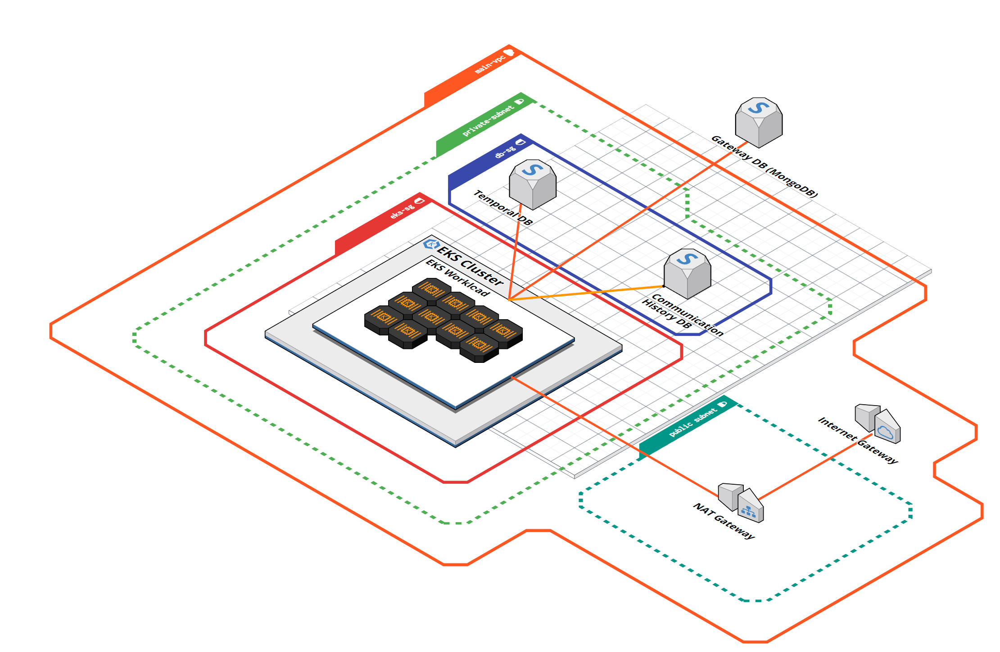

# Deployment Diagram
This section explains the different components of the cloud deployment

* EKS Compute Types
  * On Demand (with savings plan)
    * Temporal
  * 2 Spot Instances -  instantiate one replica of each pod on each instance, to ensure the high availability of the service.
    * Communication APIs (Auth, Schedule, History, Preferences, Gateway)
    * Web Management Portal
    * Portal BFF
* Databases
  * Aurora Postgresql - Used for Temporal's Datastore
  * DynamoDb - used to store the gateway table
* SQS FIFO Queue - used to check if the gateways have sent the communication recently