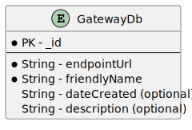
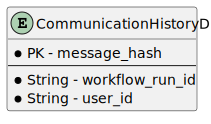

# Platform Design Resources
<!-- TOC -->
* [Platform Design Resources](#platform-design-resources)
  * [Design diagrams:](#design-diagrams)
    * [System Context (C1):](#system-context-c1)
    * [System Containers (C2):](#system-containers-c2)
    * [System Components (C3):](#system-components-c3)
    * [Class Diagrams (C4):](#class-diagrams-c4)
    * [Activity Diagrams:](#activity-diagrams)
    * [Sequence Diagrams:](#sequence-diagrams)
    * [Database Schema:](#database-schema)
    * [Interface Diagrams:](#interface-diagrams)
  * [Deployment Diagram:](#deployment-diagram)
<!-- TOC -->

This folder contains the PlantUML design diagrams for the Communication Scheduling Platform.
- Exported SVGs can be found in the `Images` folder.
- Find the swagger documentation for APIs below
  - [Communication APIs](communication-api.yaml)
  - [Reference Gateway API](reference-gateway-api.yaml)

For a cost analysis of the platform, download the [Cost Analysis](Cost%20Analysis%20V2.xlsx) spreadsheet.

## Design diagrams:
This section contains the design diagrams with explanations for the Communication Scheduling Platform created with PlantUML.

### System Context (C1):
The system has two users. A business user manages and monitors the communications sent to customers and a customer user receives the communications by different communication channels (gateways).

The gateways are the components that send messages to the customer, ensuring that a gateway only sends the same message once.

1. [System Context Diagram:](System%20Context/SystemContextDiagram.puml)  
   

### System Containers (C2):
- Expanding the communication scheduling platform, the platform components are shown:
- The business user interacts with the web management portal (or can integrate directly into the communication APIs).
- The portal talks to a BFF API that forwards requests to the communication APIs.
- A config map in Kubernetes stores the system preferences.
- Temporal manages the lifecycle of workflows with the workers and talks to its own database.
- The gateways use a database to store a history of sent communications to ensure they are only sent once.
2. [System Container Diagram:](System%20Context/SystemContainerDiagram.puml)  
   

### System Components (C3):
3. [Communication API Component:](System%20Context/Components/CommunicationAPIComponent.puml)
All Java APIs used the latest Spring Boot version (3.2.4). 
The five main APIs are:
- Auth API – Generates JWT tokens with specific scopes to authenticate with the other APIs.
- Gateway API – CRUD operations for gateways.
- Preferences API – Stores retry policies and preferences used for the Temporal activities.
- History API – Retrieves information about previously sent communications.
- Schedule API – CRUD operations for communication schedules.  
Each API is its own microservice running on the cluster. The gateway API interacts with its database and the preferences API stores preferences as a Kubernetes config map. The schedule and history APIs store and read from Temporal. Each API has a controller and a service layer to separate dependencies. 
   

4. [Worker Component:](System%20Context/Components/WorkerComponent.puml)  
- To enhance security, the worker uses a data converter component that encrypts, and decrypts data sent to and from Temporal. 
- The worker executes Communication Workflows. The worker reads the configuration map to use the retry policy and gateway timeout set for the subsequent activities.
- Workers read the gateway database to know where the communication should be sent. 
- Finally, the worker passes the required information to a gateway and sends the message to the customer.

   

### Class Diagrams (C4):
5. [Worker Component Class Diagram](System%20Context/Components/CommunicationWorkflowClassDiagram.puml)  
The Communication Workflow consists of three activities. The first activity reads the preferences configuration map to determine the retry policy for the next activities. The next activity resolves the gateway ID passed to the workflow; it retrieves the gateway object from the MongoDB database. The final activity sends the message to the gateway.    
   

### Activity Diagrams:
6. [Send Communication Workflow](Activity%20Diagrams/SendCommunicationWorkflow.puml)  
The workflow executes the three activities in order: GetPreferencesActivity, GetGatewayActivity and SendMessageToGatewayActivity. If one activity fails, Temporal retries the activity based on the retry policy managed by the Preferences API and the configuration map stored on the cluster.   
   

7. [GetPreferencesActivity](Activity%20Diagrams/GetPreferencesActivity.puml)  
This activity involves retrieving the user preferences stored on the Kubernetes cluster. For the data model that represents the configuration map. The worker uses a Kubernetes client to get the configuration map. The worker parses the JSON to the data model and returns the object completing the activity. If there is an error, the activity is failed and retried by Temporal.  
   

8. [GetGatewayActivity](Activity%20Diagrams/GetGatewayActivity.puml)  
This activity retrieves the gateway object from the database for a given ID. The gateway object contains information about the gateway URL for the worker to later send the notification to in the next activity. If the gateway cannot be found, the worker fails the activity, and it is retried by Temporal according to the retry policy.  
   

9. [SendMessageToGatewayActivity](Activity%20Diagrams/SendMessageToGatewayActivity.puml)  
- To ensure communications are only sent once, I hash the message contents with the WorkflowRunID provided by Temporal and store this in the history database. 

- The worker sends the user ID and run ID to a gateway with the API key. The gateway checks the API key. If invalid, the gateway returns a 401 or 403 response, and the worker fails the activity and retires. This allows businesses to correct the API key in the configuration and not lose the communication needing to be sent. If the key is valid, the gateway generates the message contents and then hashes a string value of the message with the run ID. 

- The gateway checks the history database for the same hash key, if it exists then the message has already been processed and so the gateway delivers a 200 response to the worker which then completes the activity. If the key does not exist, the gateway stores the new run ID, user ID and hash key in the database to prevent duplicate communications. The gateway sends the message to the user and if successful, returns a 200 response to the worker and the activity completes. If a message was unsuccessful, the gateway removes the hash key from the database and returns a 500 response and the worker fails the activity.

   

### Sequence Diagrams:
10. [Create New Schedule:](Sequence%20Diagrams/CreateNewSchedule.puml)  
    This describes a business user using the web portal to manually create a new communication schedule between a gateway and a user.  
     The user requests to create a new schedule through the portal. The portal communicates to the BFF and forwards the request to the correct API. The schedule API checks the JWT token provided and creates the scheduled workflow in Temporal. The result is passed back to the BFF which formats and forwards the result to the portal.
    

11. [Send Communication:](Sequence%20Diagrams/SendCommunication.puml)  
This demonstrates the messages transferred between temporal, the workers, the database and the communication gateway when executing a workflow.  
    

12. [Handle Send Communication Activity Error:](Sequence%20Diagrams/SendCommunicationHandleError.puml)  
    This diagram demonstrates how temporal can retry an activity if one of the activities are not executing correctly.  

    The worker is started and polls Temporal’s task queue. When it’s time to send a communication, Temporal schedules a new Communication Workflow, and creates a new run ID. The worker removes the task from the queue and starts the workflow, it coordinates each activity with Temporal. The first activity is scheduled, and the worker retrieves the configuration from Kubernetes. The worker completes the activity and Temporal schedules the next activity to retrieve the gateway from the database. Once this activity completes, Temporal schedules the “SendCommunicationActivity”. The worker sends the user ID and workflow run ID to the gateway. If the gateway encountered an error and cannot send the message, it returns an error status to the worker. The worker fails the activity and Temporal retries the activity if configured to do so in the retry policy. If the message is sent on the second attempt the worker completes the last activity and thus completes the entire workflow.
    
13. [Invoke Gateway:](Sequence%20Diagrams/InvokeGateway.puml)  
    The worker invokes the gateway to send a message to a user.  
    Here, the business has separate user and product databases that they can perform a left join on. 
The gateway receives a message containing the user ID, run ID. It validates the API key and proceeds to retrieve the user and product metrics. The gateway generates the message contents from the metrics and creates the message hash with the run ID and contents. Then, it checks the history database ensuring it’s not already sent the message and finally, sends the message and returns a status 200 result to the worker.

    

### Database Schema:
14. [Gateway Database (MongoDB) Schema](Database/gatewayDbSchema.puml)   
- The Gateway API uses the Spring Data library to add annotations to the Gateway class and follows the schema below
- The ID, endpoint URL and friendly name are required fields. This is enforced by using the Jakarta “@NotBlank” annotation.
- The description is therefore optional, and the date created attribute is automatically set by the service layer when creating a new gateway.
- The date is stored as a string for compatibility between Java and JavaScript for use in the web portal.   
    

15. [Communication History (DynamoDB) Schema](Database/CommunicationHistoryDbSchema.puml)  
- The schema consists of the message hash being the primary key which is generated from the message contents and the workflow run ID.
- This distinguishes between different messages and prevents duplicate messages.
   - If the message content or the run ID is different than a different message hash is generated resulting in a new message being sent.
- The gateways use the history database to check if they have previously sent the message.
- The database also holds the run ID and the user ID for debugging purposes.
- If you need to see further details, use the run ID and the user ID to find the workflow within Temporal.  
    
### Interface Diagrams:
16. [Communication APIs](System%20Context/Components/ApiInterfaces.puml)  
    This interface diagram shows each controller and service methods for each of the 5 APIs
    

17. [Gateway Library](System%20Context/Components/GatewayInterfaces.puml)  
To enable businesses to develop their own gateways I’ve published the gateway library on [Maven Central](https://central.sonatype.com/artifact/io.github.cameronward301.communication_scheduler/gateway-library/overview). Businesses can add this library to their dependencies and follow the instructions in the [README](../gateway-library/README.md) and use the example [Mock](../mock-gateway/README.md), [Email](../email-gateway/README.md) and [SMS](../email-gateway/README.md) reference gateways.

    The diagram below shows the interfaces and classes provided by the library using an Email Gateway as an example.

    The Gateway library provides an abstract class called “GatewayProperties.” This class encapsulates all the configuration for gateway to send a particular message. It holds:
    - the user ID to send the message to.
    - the run ID to prevent message duplicates.
    - a “UserContentService” instance that resolves the user ID to a user object from the company’s internal systems and retrieves any data to include in the message. 
    -	a “ContentDeliveryService” instance that is responsible for generating and sending the message through third-party APIs or businesses’ internal systems.
    -	a “CommunicationHistoryAccessProvider” instance that is responsible for reading and writing to the history database to prevent duplicates.  

    Businesses can provide their own “CommunicationHistoryAccessProvider” implementation or pass the default one provided by the library to use AWS DynamoDB. The properties object is created in the constructor of each gateway.

    Businesses must create a controller class that implements the “GatewayController” interface. They must implement the “processGatewayRequest” method that specifies the gateways endpoint URL. It receives aGatewayRequest object containing the user ID and run ID. The interface provides a static“sendCommunication” method that calls the “CommunicationGatewayService” instance to handle the gateway logic The controller must return the “GatewayResponse” “ResponseEntity” that is returned from the static method. It contains the delivery result for the worker to process the activity results.

    The “DefaultCommunicationHistoryAccessProvider” handles reading/writing/removing previous communications to the history database. Business can implement their own “CommunicationHistoryAccessProvider” and set this in the “GatewayProperties” object. The access provider must provide implementations for retrieving, removing, and storing messages. The “CommunicationGatewayService” is responsible for using the access provider to carry out the operations. It has a hash helper instance injected as a dependency that generates the hash from the message contents and run ID. 

    The “EmailUserContentService” is created by the business and should implement the “UserContentService” interface and optionally extend the GetUserAndContent abstract class. The abstract class is provided here to accommodate business's existing infrastructure. It may not be possible to do a left join with their internal databases and so information is queried separately.

    “UserAndContent” is an object that holds the user and content details. The use of generics with this interface allows businesses to specify their user and content models to match their requirements.

    “EmailContentDeliveryService” implements the “ContentDeliveryServiceInterface” to send communications to the end destination for example, Twilio for email delivery. It is invoked by the “CommunicationGatewayService”. 

## Deployment Diagram:
The deployment diagram gives a visual representation of the resources deployed through the [Terragrunt project](../deployment/terragrunt).  
The main resources deployed are:
* EKS cluster
* Spot and on demand Nodes
* RDS Database for Temporal
* DynamoDB table for the communication histories
* MongoDB table for the available gateways
* Public and private subnets
* Internet and NAT gateway

