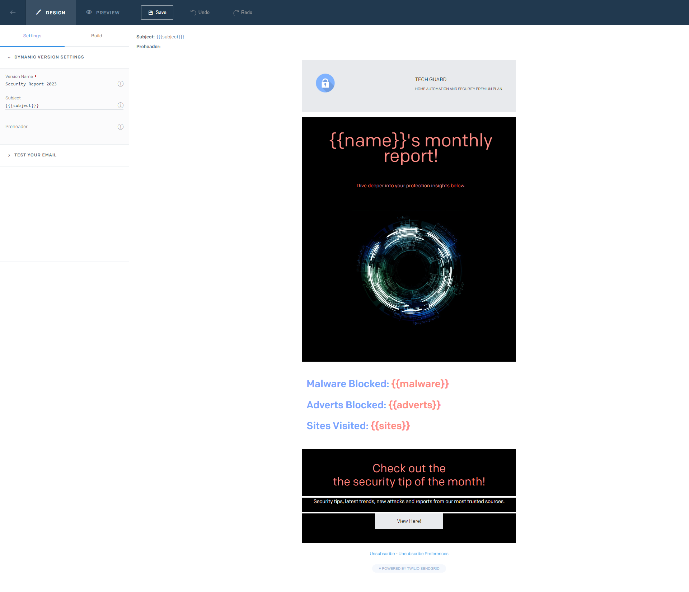

# Email Gateway

- This is example gateway built with Spring Boot and the [gateway library](../gateway-library) to send email messages to customers.  
- Use this project as a reference guide to integrate the gateway library into your own project.
- The gateway receives a user ID and generates a report containing antivirus and anti-malware statistics for the month and sends it to the user's email address.  
- For simplicity, this gateway uses an in-memory database and the statistics are randomly generated when the gateway starts up.
The email address for each user is passed in as an environment variable. See [configuration section](#configuration) for more details.
    - User 1:
        - ID: 62f8a8e1-f55a-4d9a-ab15-852168a321a4
        - First Name: Cameron
    - User 2:
        - ID: f882fa87-c249-4c14-bb61-78542217f79d
        - First Name: Cameron
- Check SPAM folders if the email is not received in the inbox.

## API Specification
See [swagger specification for gateways](https://app.swaggerhub.com/apis/CameronWard301/Gateway_API/1.1.3) for request body and header requirements.
This gateway exposes the endpoint `POST /email/monthly-report` to generate a monthly report and send it to a customer.

## Getting Started

Follow these instructions to run the project locally and configure for kubernetes deployment

### Prerequisites

Ensure you have the following installed or configured:

- [Java 21](https://www.oracle.com/java/technologies/downloads/#java21)
- [Maven 3.8.7 or newer](https://maven.apache.org/download.cgi)
- History database (AWS DynamoDB) with the [schema defined here](../Designs/Images/Database/CommunicationHistoryDbSchema.svg)
  - Deploy one using the [Terragrunt library](../deployment/terragrunt)
- [Sendgrid account](https://docs.sendgrid.com/for-developers/sending-email/api-getting-started) to send emails
  - Follow the [documentation](https://docs.sendgrid.com/for-developers/sending-email/api-getting-started) to create an API key.
  - Create a [dynamic template](https://docs.sendgrid.com/ui/sending-email/how-to-send-an-email-with-dynamic-templates). Optionally add the following fields in the template to use the data generated by the gateway in the email
      - name
      - subject
      - malware
      - adverts
      - sites
    - The template should look like this when completed:
    - 

### Configuration

This section describes the configuration options available for the gateway via environment variables and spring profiles
- Run the project with the `ssl` profile to enable SSL
- To generate a self-signed keystore file for development purposes, run the following command in the project directory:
    - `keytool -genkeypair -alias email-gateway -keyalg RSA -keysize 2048 -storetype PKCS12 -keystore email-gateway.p12 -validity 3650`
        - Follow prompts to set the keystore password.
        - Place the generated file in src/main/resources/keystore
    - If you don't want to place the file in the resources folder:
        - Run `base64 -e -i .\email-gateway.p12 -o email-gateway-base64.txt` to encode the keystore file for use in kubernetes secrets that will set the `GATEWAY_API_SSL_KEY_STORE` to be the data in the text file you've just generated.

> [!CAUTION]
> Setting CORS_ENABLED or CSRF_ENABLED to false should NOT be used in a live production environment, it should only be used when testing with self-signed SSL certificates.

| Environment Variable                 | Description                                                                                                                                                                                                                | Default Value                        | Required               |
|--------------------------------------|----------------------------------------------------------------------------------------------------------------------------------------------------------------------------------------------------------------------------|--------------------------------------|------------------------| 
| EMAIL_NEWSLETTER_API                 | Your Sendgrid API key. It should start with "SG."                                                                                                                                                                          |                                      | Y                      |
| FROM_EMAIL                           | The email address that the will be used to send the message                                                                                                                                                                |                                      | Y                      | 
| FROM_NAME                            | The name of the sender                                                                                                                                                                                                     |                                      | Y                      | 
| MONTHLY_NEWSLETTER_TEMPLATE_ID       | The dynamic template ID created in Sendgrid                                                                                                                                                                                |                                      | Y                      | 
| USER1_EMAIL                          | The email address belonging to User 1 (ID: 62f8a8e1-f55a-4d9a-ab15-852168a321a4), this is the recipient address if a request is made using this ID                                                                         |                                      | Y                      | 
| USER2_EMAIL                          | The email address belonging to User 2 (ID: f882fa87-c249-4c14-bb61-78542217f79d), this is the recipient address if a request is made using this ID                                                                         |                                      | Y                      | 
| WORKER_API_KEY                       | A secret key to authenticate requests. Requests must include this key as a header labelled `x-worker-api-key`. This should be set to the value that the [worker](../communication-worker) will send in the request header. |                                      | Y                      | 
| REGION                               | The region of the DynamoDB table. E.g. "eu-west-1"                                                                                                                                                                         | eu-west-1                            | Y                      | 
| COMMUNICATION_HISTORY_TABLE_NAME     | The name of the DynamoDB table                                                                                                                                                                                             | communication-history                | Y                      | 
| EMAIL_GATEWAY_SSL_KEY_STORE_PASSWORD | The keystore password to access the keystore                                                                                                                                                                               |                                      | Y if using SSL profile |
| EMAIL_GATEWAY_SSL_KEY_STORE          | The file path or file containing the public and private keys in PKCS12 format                                                                                                                                              | classpath:keystore/email-gateway.p12 | N                      |
| ROOT_LOGGING                         | The root [logging level](https://docs.spring.io/spring-boot/docs/2.1.13.RELEASE/reference/html/boot-features-logging.html#boot-features-logging-format) for the project                                                    | info                                 | N                      |
| GATEWAY_LOGGING                      | The [logging level](https://docs.spring.io/spring-boot/docs/2.1.13.RELEASE/reference/html/boot-features-logging.html#boot-features-logging-format) for the gateway library                                                 | info                                 | N                      |
| CORS_ENABLED                         | Sets the CORS check when processing a request. Set to false for testing purposes to disable                                                                                                                                | true                                 | N                      |
| CSRF_ENABLED                         | Sets the CSRF check when processing a request. Set to false for testing purposes to disable                                                                                                                                | true                                 | N                      |

### Installing & Running Locally

Follow the instructions below to get a development environment running:
1. Clone the repository
2. Navigate to the project directory
3. Run `mvn clean install` to build and test the project
4. Run `mvn spring-boot:run` to start the server
    - Run `mvn spring-boot:run -Dspring-boot.run.profiles=ssl` to start the server with SSL enabled (requires extra configuration)

## Running the tests

- To run the unit tests, run `mvn test` in the project directory
- To run the integration tests see the [Integration Tests Project](../integration-tests)
  and make sure that the `@EmailGateway` is added to the filter expression.

## Deployment

- Run the command from the project root to build and push a new image for both arm and amd platforms.
    - `docker buildx build --platform linux/amd64,linux/arm64 -t <account name>/<image-name>:<image-tag> --push .`
- See [helm deployment](../deployment/helm) to deploy the Email Gateway to a kubernetes cluster.

## Built With
- [Spring Boot](https://spring.io/projects/spring-boot)
- [Maven](https://maven.apache.org/)
- [Gateway Library](../gateway-library)
- [Sendgrid](https://sendgrid.com/)
